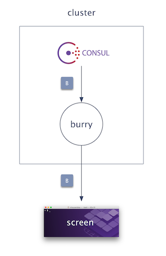
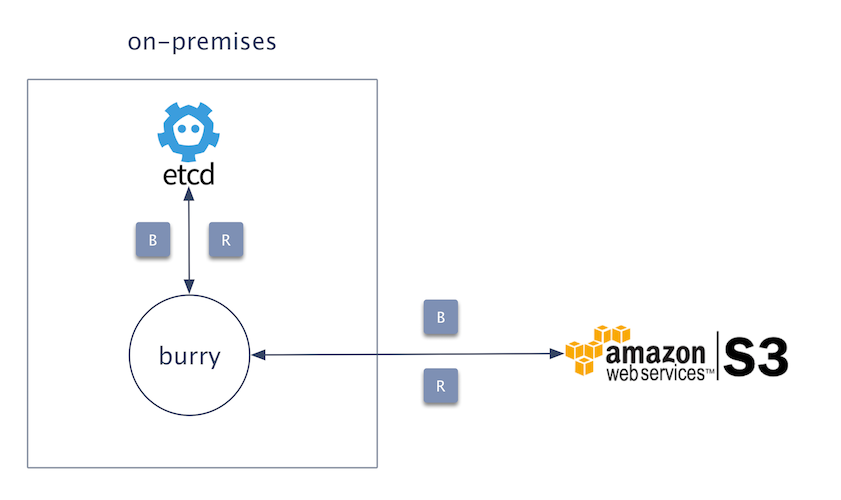
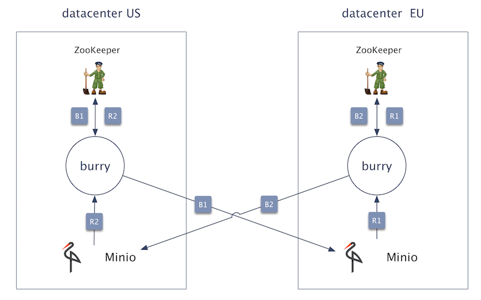

# Background

Some notes on where and how you can use `burry` and what the design considerations were.

## Use cases

### UC1: Debugging

You can use `burry` to debug an infra service:

A concrete example: [screen dump of local ZooKeeper content](../../#screen-dump-of-local-zookeeper-content).

### UC2: Simple standby

You can use  `burry` to back up and restore an on-premises infra service to/from the public cloud:

A concrete example: [Restore Consul from Minio](../../#restore-consul-from-minio).

### UC3: Cross-cluster failover

You can use `burry` to perform cross-cluster failover:

- Let's assume the cluster in `datacenter US` is the primary, active one.
- [B1] You perform regular backups of ZK to Minio running in `datacenter EU`
- [R1] If ZK in `datacenter US` fails, you failover to `datacenter EU` and restore the state from Minio there.
- [B2/R2] Same in the other direction.

## Design considerations

### Design goals

- The tool must be **safe** to use: only non-existing nodes or keys will shall be restored, that is, no existing data in ZK or etcd will be overwritten when attempting to carry out a restore operation. This extends also to security consideration, such as leaking sensitive data or enabling protection of the data backed up.
- The tool must be **usable**: simple things should be simple (sane defaults) and complex workflow must be possible to support.
- The tool's operation must be **transparent**: at any point in time the actions must be deterministic and explained (logs, documentation, etc.).

### Assumptions

`burry` assumes that the infra service it operates on is tree-like. 

### Backup algorithm

The essence of `burry`'s backup algorithm is:

- Walk the tree from the root of the infra service.
- For every non-leaf node in infra service: create a sub-directory in the local filesystem and process its children.
- For every leaf node in infra service, store the content (that is, the node value) in a corresponding file. 
- Depending on the storage target selected, create archive incl. metadata (possibly to remote).

### Restore algorithm

The essence of `burry`'s restore algorithm is:

- Depending on the storage target selected, download the archive (possibly from remote).
- Unarchive and walk the directory tree.
- For every directory create a non-leaf node in infra service and process its children.
- For every file create a leaf node in infra service.
